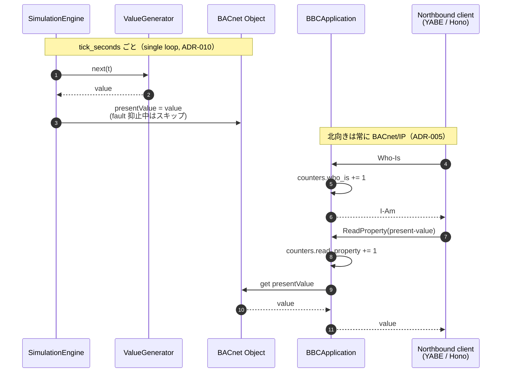
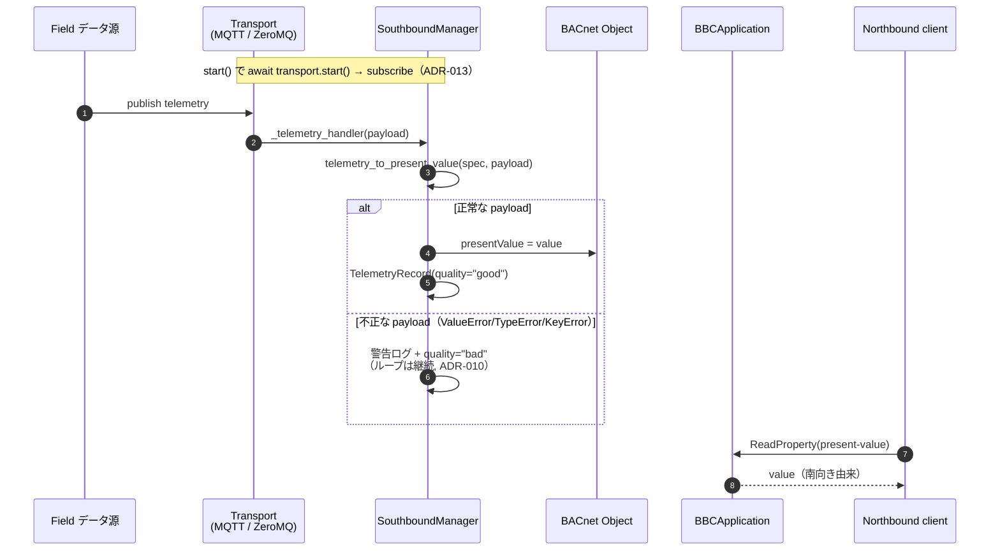
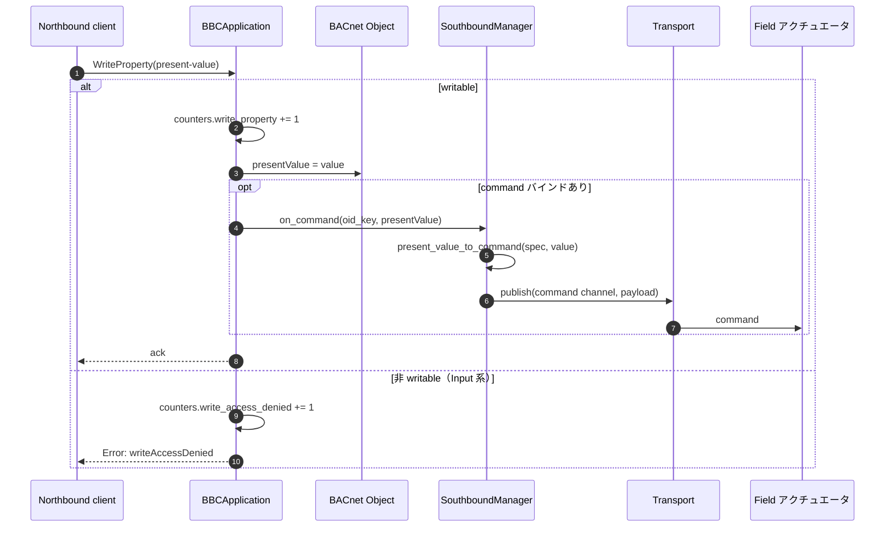
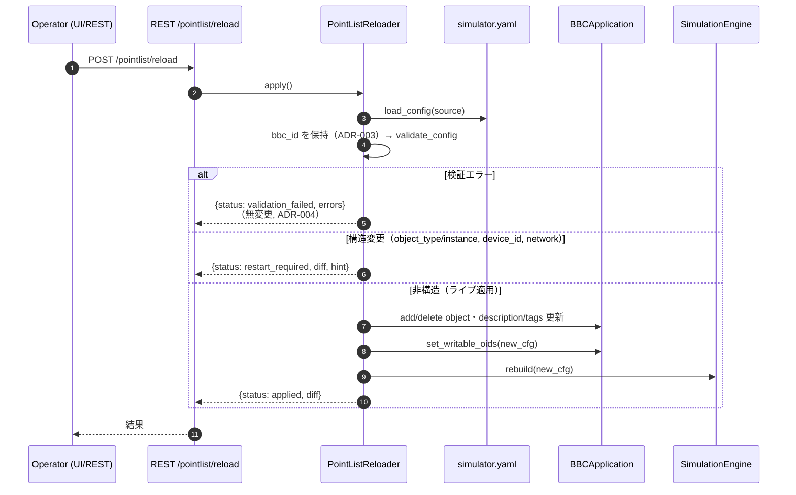
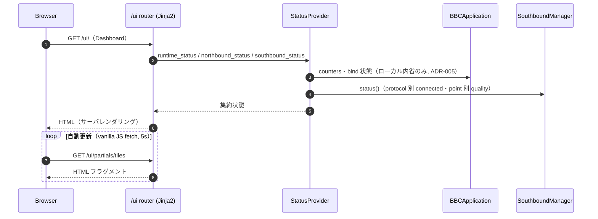
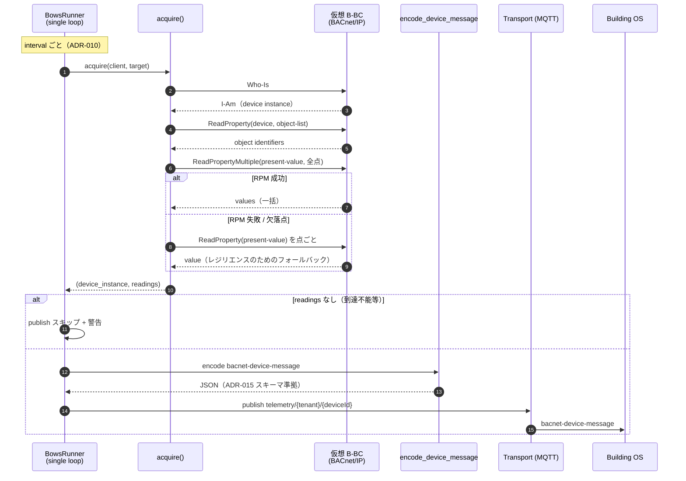

# 通信シーケンス図 — 代表的なフロー

> 本書は bbc-sim の**代表的な通信**をシーケンス図（Mermaid）で示す設計ドキュメントです。
> 各図は実装（`src/bbc_sim/`）に対応し、関連する ADR を併記します。
> 関連: [`operating-modes.md`](operating-modes.md)（モード）, [`southbound-binding.md`](southbound-binding.md)（南向き）,
> [`northbound-bows-buildingos.md`](northbound-bows-buildingos.md)（BOWS）, `../memory/architecture.md`（全体像）。

## 不変条件（全図に共通）

- **北向き = BACnet/IP、南向き = MQTT/ZeroMQ/WoT/gRPC**（[[ADR-005]]）
- **single-loop asyncio・非ブロッキング**（[[ADR-010]]）
- **`gateway_id` ≠ `bbc_id`**（[[ADR-003]]）

| # | フロー | 主な構成要素 | モード |
|---|--------|--------------|--------|
| 1 | Simulator: 値生成 → 北向き読取 | `SimulationEngine` / `BBCApplication` | simulator |
| 2 | Gateway: 南向きテレメトリ取込 → 北向き読取 | `SouthboundManager` / `Transport` | gateway / combined |
| 3 | Gateway: 北向き書込 → 南向きコマンド送出 | `BBCApplication` / `SouthboundManager` | gateway / combined |
| 4 | 点リスト再読込（検証→差分→適用/再起動要求） | `PointListReloader` | 全モード |
| 5 | Admin UI / REST 状態取得 | `web.router` / `StatusProvider` | 全モード |
| 6 | BOWS: BACnet 取込 → Building OS へ MQTT 供給 | `BowsRunner` / `acquire` / `encoder` | EP-008 |

---

## 1. Simulator モード — 値生成と北向き読取

内部生成した値を BACnet オブジェクトに反映し、上位の BACnet クライアント（YABE / 接続ゲートウェイ）が
Who-Is / ReadProperty で取得する（`simulation/engine.py`, `simulator_runtime/app.py`）。

## 2. Gateway モード — 南向きテレメトリ取込 → 北向き読取

南向き（MQTT/ZeroMQ）で受信した実データを `presentValue` に反映し、北向きへ投影する
（`southbound/binding.py`）。値の出所（source of record）は南向き。

## 3. Gateway モード — 北向き書込 → 南向きコマンド送出

書込可能（writable）かつ command バインドされたオブジェクトへの北向き WriteProperty を、
南向きへコマンドとして送出する（`simulator_runtime/app.py`, `southbound/binding.py`）。

## 4. 点リスト再読込 — 検証 → 差分 → 適用 or 再起動要求

`simulator.yaml` を再読込し、検証に通れば差分を分類してライブ適用、構造変更なら再起動要求を返す
（`rest/reload.py`, [[ADR-004]]）。検証失敗時は**何も変更しない**（安全ゲート）。

## 5. Admin UI / REST — 状態取得（北向きはローカル内省のみ）

ブラウザがサーバレンダリングの `/ui` を取得し、`StatusProvider` が live 状態を集約する
（`web/router.py`, `rest/status.py`）。**北向きはローカル内省のみで上流へプローブしない**（[[ADR-005]]）。

## 6. BOWS コネクタ — BACnet 取込 → Building OS へ MQTT 供給

仮想 B-BC を BACnet クライアントとして読み、`bacnet-device-message` に変換して MQTT へ publish する
（`bows/runner.py`, `bows/acquire.py`, `bows/encoder.py`）。BOWS は **B-BC の下流の独立コネクタ**であり、
その MQTT 出力は connector→Building OS のリンク（[[ADR-014]]）。B-BC の方向不変条件は変えない（[[ADR-005]]）。

---

## 補足

- 図中のカウンタ（`counters.*`）は `BBCApplication` が北向きリクエストを非ブロッキングに計数するもので、
  `/status/northbound` と Admin UI に表示される（[[ADR-010]]）。
- COV（変化購読）通知は北向きの最適化であり本書の代表フローには含めない（`bacnet-service-priority.md` 参照）。
- モード切替（`/mode`）はライブ適用せず再起動要求を返す（[[ADR-010]]、`rest/api.py`）。
